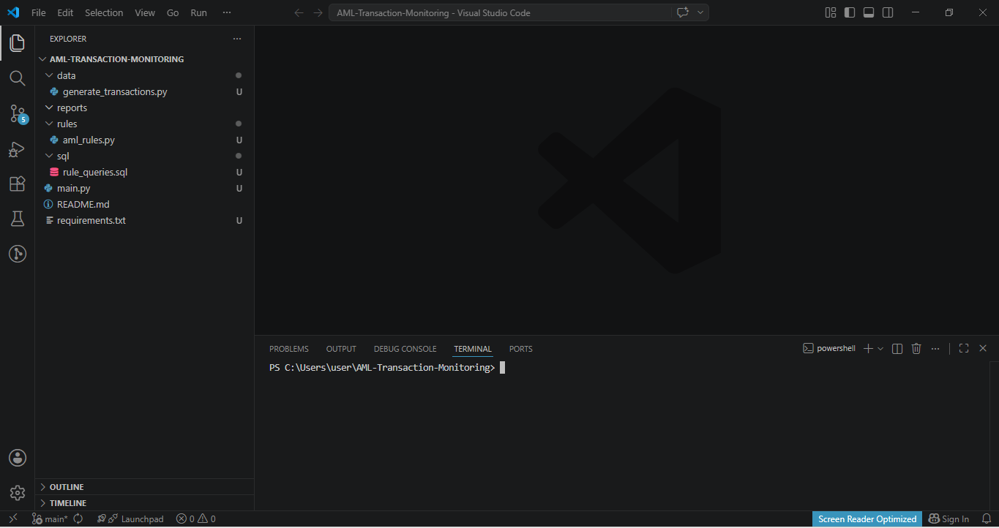
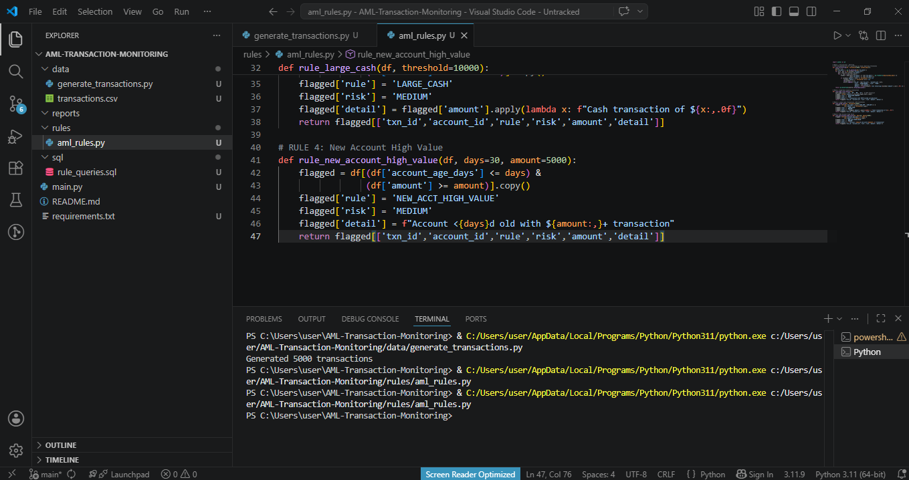
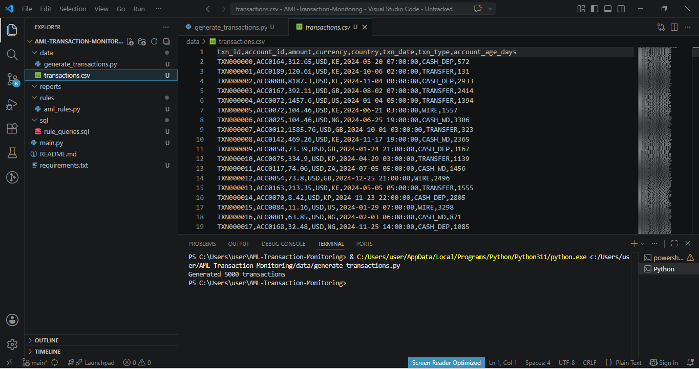

# AML-Transaction-Monitoring Engine

##1. Introduction 

This engine automates the identification of high-risk financial patterns within large datasets. It is designed to replace manual spreadsheet reviews with high-speed, programmatic screening, detecting complex red flags like structuring and jurisdictional risk across 5,000+ transactions in seconds.

##2. Technologies List

* **Language:** Python 3.11
  
* **Libraries:** Pandas (High-speed data screening)

* **Database Logic:** SQL

* **Version Control:** Git & GitHub
  

## 3. Features

* **Synthetic Data Generation:** Simulates a core banking environment with 5,000 transactions.

* **Automated Logic Engine:** Runs 4 distinct forensic rules simultaneously.

* **Risk Categorization:** Automatically assigns risk levels based on rule hits.

* **Forensic Reporting:** Outputs a standardized aml_alerts_report.csv.

*Figure 1: Professional Workplace Environment and Project Directory Structure.*

*Figure 2: Programmatic implementation of regulatory detection rules.*

##4. Keyboard Shortcuts

* **Ctrl + S:** Save logic/rule updates.

* **Ctrl + ~:** Toggle integrated terminal.

* **Alt + Shift + F:** Standardize code formatting.

* **F5:** Debug and run the engine.
  

##5. The Process

* **Requirement Analysis:** Defined the legal parameters for "suspicious" activity.

* **Data Engineering:** Built a generator to create a realistic transaction dataset.

* **Logic Encoding:** Translated regulatory red flags into executable Python scripts.

* **Audit Generation:** Automated the output of forensic findings into a portable format.

*Figure 3: Raw transaction evidence containing 5,000 records prior to screening.*

##6. What I Learned

* **Regulatory Translation:** Converting abstract legal standards into precise, automated parameters.

* **Scalable Auditing:** The efficiency advantage of programmatic screening over manual review.

* **Version Control:** Managing a professional-grade forensic repository using Git.

##7. How it Can be Improved

* **Fuzzy Matching:** Implementing logic to detect misspelled names against sanction lists.

* **Behavioral Profiling:** Identifying anomalous patterns in transaction velocity.

* **Visualization:** Developing a dashboard to map the geographical flow of high-risk funds.

##8. Running the Project

* **Clone** the repository.

* **Install dependencies:** pip install -r requirements.txt.

* **Execute the engine:** python main.py.

* **Review results:** Locate findings in the reports/ folder.

Confirmation of final project deployment and remote synchronization.
